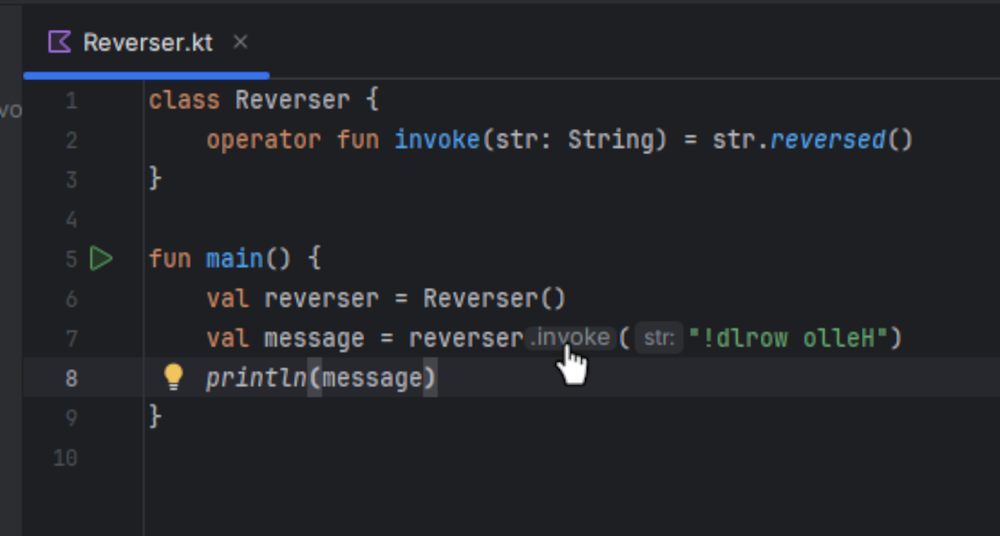

# UncloakInvoke


[](https://plugins.jetbrains.com/plugin/25975-uncloak-invoke)
[](https://plugins.jetbrains.com/plugin/25975-uncloak-invoke)

<!-- Plugin description -->
This plugin adds a clickable inlay hint for the implicit `invoke` call made when a Kotlin instance with an `operator fun invoke()` method is called as a function.

Clicking the hint will navigate to the `invoke` method.
This is useful because there is no current way to do this directly in the IDE.

E.g.
```
class Reverser {
  operator fun invoke(str: String) = str.reverse()
}

val reverser = Reverser()
println(reverser(“!dlrow olleH”)) 
```
Navigating to the declaration of `reverser` on the last line will take you to the declaration of the `val reverser`.
Navigating to the type of `reverser` will take you to the `class Reverser`, but you will still have to locate the invoke method yourself, which is not always straightforward.

The inlay added by this plugin gives you a direct link to the invoke method, which is handy when browsing and debugging code that uses objects as functions.
                               


<!-- Plugin description end -->

## Installation

- Using the IDE built-in plugin system:
  
  <kbd>Settings/Preferences</kbd> > <kbd>Plugins</kbd> > <kbd>Marketplace</kbd> > <kbd>Search for "uncloak-invoke"</kbd> >
  <kbd>Install</kbd>
  
- Using JetBrains Marketplace:

  Go to [JetBrains Marketplace](https://plugins.jetbrains.com/plugin/25975-uncloak-invoke) and install it by clicking the <kbd>Install to ...</kbd> button in case your IDE is running.

  You can also download the [latest release](https://plugins.jetbrains.com/plugin/25975-uncloak-invoke/versions) from JetBrains Marketplace and install it manually using
  <kbd>Settings/Preferences</kbd> > <kbd>Plugins</kbd> > <kbd>⚙️</kbd> > <kbd>Install plugin from disk...</kbd>

- Manually:

  Download the [latest release](https://github.com/nathanmbrown/uncloak-invoke/releases/latest) and install it manually using
  <kbd>Settings/Preferences</kbd> > <kbd>Plugins</kbd> > <kbd>⚙️</kbd> > <kbd>Install plugin from disk...</kbd>


---
Plugin based on the [IntelliJ Platform Plugin Template][template].

[template]: https://github.com/JetBrains/intellij-platform-plugin-template
[docs:plugin-description]: https://plugins.jetbrains.com/docs/intellij/plugin-user-experience.html#plugin-description-and-presentation
